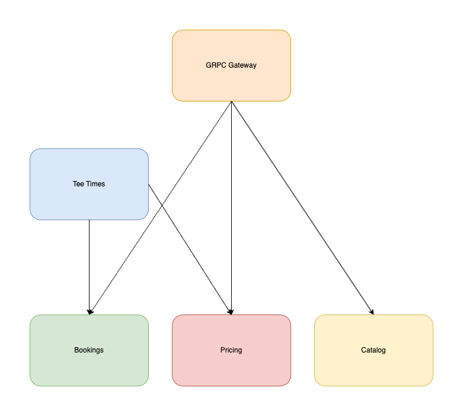

# fairways-core

## Introduction
This repository contains a few backend microservices used by the Fairways project. The project is a simple golf course management system that allows users to book tee times, view course information, and more.

## Services
The project is split into a few different services, each with their own responsibilities. The services are as follows:
- **pricing**: Handles setting base prices for tee times and dynamic pricing rules.
- **booking**: Handles booking tee times.
- **catalog**: Handles course information.
- **tee_time**: Handles generating available tee times and prices.
- **gateway**: Handles translating http requests to grpc.

## Diagram




## Getting Started

```bash
docker-compose up -d
make run-migrations
make generate-data
docker-compose up -d
```

## Generate Tee Times

```bash
curl --location 'localhost:8081/v1/teetimes?course_id=1&date=2024-06-07&golfers=1'
```

```json
{
    "teetimes": [
        {
            "course_id": "1",
            "datetime": "2024-06-07T09:00:00Z",
            "price": 22,
            "original_price": 22,
            "discounted": false,
            "available": true
        },
        {
            "course_id": "1",
            "datetime": "2024-06-07T09:12:00Z",
            "price": 22,
            "original_price": 22,
            "discounted": false,
            "available": true
        },
        {
            "course_id": "1",
            "datetime": "2024-06-07T09:24:00Z",
            "price": 22,
            "original_price": 22,
            "discounted": false,
            "available": true
        },
        {
            "course_id": "1",
            "datetime": "2024-06-07T09:36:00Z",
            "price": 22,
            "original_price": 22,
            "discounted": false,
            "available": true
        },
        {
            "course_id": "1",
            "datetime": "2024-06-07T09:48:00Z",
            "price": 22,
            "original_price": 22,
            "discounted": false,
            "available": true
        },
        {
            "course_id": "1",
            "datetime": "2024-06-07T10:00:00Z",
            "price": 22,
            "original_price": 22,
            "discounted": false,
            "available": true
        },
        {
            "course_id": "1",
            "datetime": "2024-06-07T10:12:00Z",
            "price": 22,
            "original_price": 22,
            "discounted": false,
            "available": true
        },
        {
            "course_id": "1",
            "datetime": "2024-06-07T10:24:00Z",
            "price": 22,
            "original_price": 22,
            "discounted": false,
            "available": true
        },
        {
            "course_id": "1",
            "datetime": "2024-06-07T10:36:00Z",
            "price": 22,
            "original_price": 22,
            "discounted": false,
            "available": true
        },
        {
            "course_id": "1",
            "datetime": "2024-06-07T10:48:00Z",
            "price": 22,
            "original_price": 22,
            "discounted": false,
            "available": true
        },
        {
            "course_id": "1",
            "datetime": "2024-06-07T11:00:00Z",
            "price": 22,
            "original_price": 22,
            "discounted": false,
            "available": true
        },
        {
            "course_id": "1",
            "datetime": "2024-06-07T11:12:00Z",
            "price": 22,
            "original_price": 22,
            "discounted": false,
            "available": true
        },
        {
            "course_id": "1",
            "datetime": "2024-06-07T11:24:00Z",
            "price": 22,
            "original_price": 22,
            "discounted": false,
            "available": true
        },
        {
            "course_id": "1",
            "datetime": "2024-06-07T11:36:00Z",
            "price": 22,
            "original_price": 22,
            "discounted": false,
            "available": true
        },
        {
            "course_id": "1",
            "datetime": "2024-06-07T11:48:00Z",
            "price": 22,
            "original_price": 22,
            "discounted": false,
            "available": true
        },
        {
            "course_id": "1",
            "datetime": "2024-06-07T12:00:00Z",
            "price": 22,
            "original_price": 22,
            "discounted": false,
            "available": true
        },
        {
            "course_id": "1",
            "datetime": "2024-06-07T12:12:00Z",
            "price": 22,
            "original_price": 22,
            "discounted": false,
            "available": true
        },
        {
            "course_id": "1",
            "datetime": "2024-06-07T12:24:00Z",
            "price": 22,
            "original_price": 22,
            "discounted": false,
            "available": true
        },
        {
            "course_id": "1",
            "datetime": "2024-06-07T12:36:00Z",
            "price": 22,
            "original_price": 22,
            "discounted": false,
            "available": true
        },
        {
            "course_id": "1",
            "datetime": "2024-06-07T12:48:00Z",
            "price": 22,
            "original_price": 22,
            "discounted": false,
            "available": true
        },
        {
            "course_id": "1",
            "datetime": "2024-06-07T13:00:00Z",
            "price": 22,
            "original_price": 22,
            "discounted": false,
            "available": true
        },
        {
            "course_id": "1",
            "datetime": "2024-06-07T13:12:00Z",
            "price": 22,
            "original_price": 22,
            "discounted": false,
            "available": true
        },
        {
            "course_id": "1",
            "datetime": "2024-06-07T13:24:00Z",
            "price": 22,
            "original_price": 22,
            "discounted": false,
            "available": true
        },
        {
            "course_id": "1",
            "datetime": "2024-06-07T13:36:00Z",
            "price": 22,
            "original_price": 22,
            "discounted": false,
            "available": true
        },
        {
            "course_id": "1",
            "datetime": "2024-06-07T13:48:00Z",
            "price": 22,
            "original_price": 22,
            "discounted": false,
            "available": true
        },
        {
            "course_id": "1",
            "datetime": "2024-06-07T14:00:00Z",
            "price": 22,
            "original_price": 22,
            "discounted": false,
            "available": true
        },
        {
            "course_id": "1",
            "datetime": "2024-06-07T14:12:00Z",
            "price": 22,
            "original_price": 22,
            "discounted": false,
            "available": true
        },
        {
            "course_id": "1",
            "datetime": "2024-06-07T14:24:00Z",
            "price": 22,
            "original_price": 22,
            "discounted": false,
            "available": true
        },
        {
            "course_id": "1",
            "datetime": "2024-06-07T14:36:00Z",
            "price": 22,
            "original_price": 22,
            "discounted": false,
            "available": true
        },
        {
            "course_id": "1",
            "datetime": "2024-06-07T14:48:00Z",
            "price": 22,
            "original_price": 22,
            "discounted": false,
            "available": true
        },
        {
            "course_id": "1",
            "datetime": "2024-06-07T15:00:00Z",
            "price": 22,
            "original_price": 22,
            "discounted": false,
            "available": true
        },
        {
            "course_id": "1",
            "datetime": "2024-06-07T15:12:00Z",
            "price": 22,
            "original_price": 22,
            "discounted": false,
            "available": true
        },
        {
            "course_id": "1",
            "datetime": "2024-06-07T15:24:00Z",
            "price": 22,
            "original_price": 22,
            "discounted": false,
            "available": true
        },
        {
            "course_id": "1",
            "datetime": "2024-06-07T15:36:00Z",
            "price": 22,
            "original_price": 22,
            "discounted": false,
            "available": true
        },
        {
            "course_id": "1",
            "datetime": "2024-06-07T15:48:00Z",
            "price": 22,
            "original_price": 22,
            "discounted": false,
            "available": true
        },
        {
            "course_id": "1",
            "datetime": "2024-06-07T16:00:00Z",
            "price": 22,
            "original_price": 22,
            "discounted": false,
            "available": true
        },
        {
            "course_id": "1",
            "datetime": "2024-06-07T16:12:00Z",
            "price": 22,
            "original_price": 22,
            "discounted": false,
            "available": true
        },
        {
            "course_id": "1",
            "datetime": "2024-06-07T16:24:00Z",
            "price": 22,
            "original_price": 22,
            "discounted": false,
            "available": true
        },
        {
            "course_id": "1",
            "datetime": "2024-06-07T16:36:00Z",
            "price": 22,
            "original_price": 22,
            "discounted": false,
            "available": true
        },
        {
            "course_id": "1",
            "datetime": "2024-06-07T16:48:00Z",
            "price": 22,
            "original_price": 22,
            "discounted": false,
            "available": true
        },
        {
            "course_id": "1",
            "datetime": "2024-06-07T17:00:00Z",
            "price": 22,
            "original_price": 22,
            "discounted": false,
            "available": true
        }
    ]
}
```